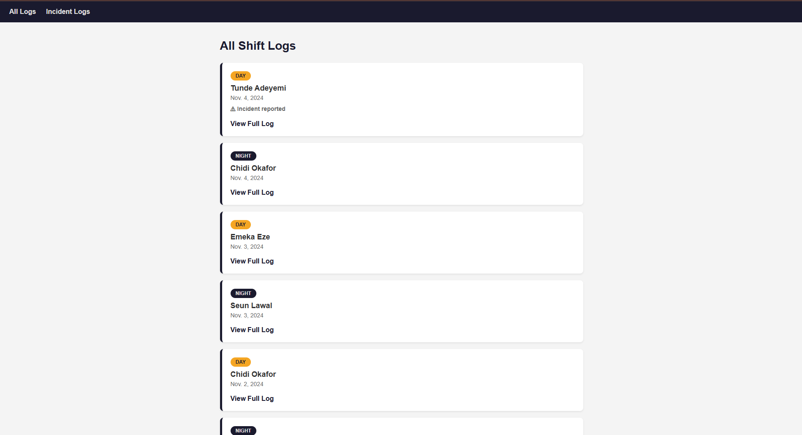
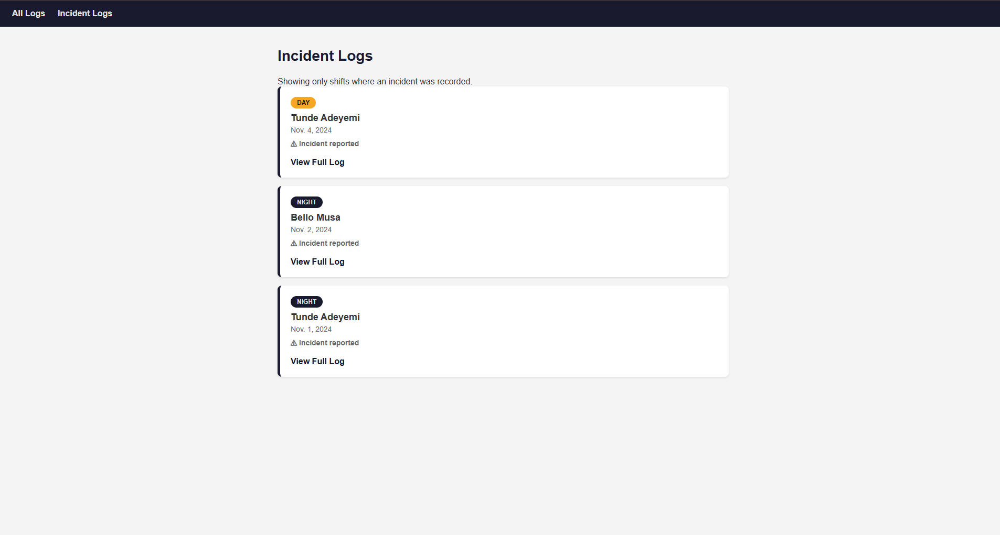

# Rig Logbook

A Django web app for oil and gas rig engineers to record and review shift logs.
Engineers log what happened each shift — equipment status, incidents, and notes —
so the incoming team always knows the current state of the rig.

---

## What the app does

- Displays all shift logs ordered by newest first
- Shows a detail page for any individual log
- Filters and displays only logs where an incident was recorded
- Highlights day and night shifts with colour-coded badges
- Django admin panel for managing records

---

## How to run it locally

**1. Clone the repo**
```bash
git clone <your-repo-url>
cd rig-logbook
```

**2. Create and activate a virtual environment**
```bash
python -m venv venv
venv\Scripts\activate
```

**3. Install dependencies**
```bash
pip install -r requirements.txt
```

**4. Run migrations**
```bash
python manage.py migrate
```

**5. Create a superuser**
```bash
python manage.py createsuperuser
```

**6. Insert sample data**
```bash
python manage.py shell
```
Paste the sample data from the shell commands in DECISIONS.md.

**7. Run the server**
```bash
python manage.py runserver
```

Visit http://127.0.0.1:8000/

---

## Screenshots




---

## Tech Stack

- Python 3
- Django
- WhiteNoise
- SQLite